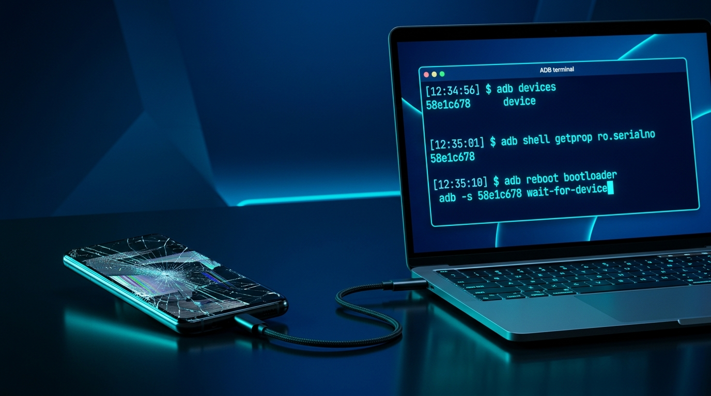

# 📱 DroidLink (ড্রয়েডলিংক) - Android Recovery & ADB Automation Workspace



**DroidLink** হলো অ্যান্ড্রয়েড ব্যবহারকারী, ট্রাবলশুটার এবং পেশাদার মোবাইল রিপেয়ার টেকনিশিয়ানদের জন্য তৈরি একটি আধুনিক, ইন্টারেক্টিভ ফুল-স্ট্যাক ওয়েব অ্যাপ্লিকেশন। ফোনের স্পর্শহীন পর্দা (Broken Touch) বা কালো স্ক্রিন (Black Screen) এর মতো জটিল মূহূর্তে হার্ডওয়্যার ওটিজি ডিভাইস, এডিবি স্ক্রিপ্ট এবং এআই রোগ নির্ণয় পদ্ধতির সমন্বয়ে কাস্টমারের মূল্যবান তথ্য উদ্ধার করার একমাত্র পরিচ্ছন্ন প্ল্যাটফর্ম এটি।

---

## 🎨 প্রজেক্টের প্রধান আর্কিটেকচার ও মডিউলসমূহ

### ১. এ.আই. ট্রাবলশুটার (A.I. Troubleshooter) - *জেমিনী এআই চালিত*
*   **রিয়েল-টাইম জেমিনি ইঞ্জিন:** জেমিনী মডেল ব্যবহার করে আপনার ফোনের লক্ষণগুলি (যেমন 'Blank Screen with Vibration', 'Ghost Touch', 'USB Debugging Off') ইনপুট দিয়ে তাৎক্ষণিক এডিবি কমান্ড সলিউশন বের করতে পারবেন।
*   **ডায়নামিক কমান্ড ডিটেকশন ও রানার:** জেমিনীর উত্তরের ভেতরে থাকা এডিবি কমান্ডসমূহ স্বয়ংক্রিয়ভাবে সনাক্ত হয়, যা আপনি এক ক্লিপে কপি করতে পারবেন এবং লাইভ স্ক্রিপ্ট সিমুলেটরে রান করে দেখতে পারবেন।

### ২. হার্ডওয়্যার এক্সেসরিজ এবং এফিলিয়েট শপ (Affiliate Hardware Integration)
*   **ওটিজি, এইচডিএমআই ডক এবং ক্যাপচার কার্ড:** প্রিমিয়াম ক্যাবল এবং ওটিজি ডক সংযোগের জন্য Daraz, AliExpress এবং Amazon-এর ভ্যালিড এফিলিয়েট লিংক ইন্টিগ্রেট করা।
*   **ইন্টারেক্টিভ কানেকশন সিমুলেটর:** ভাঙা ডিসপ্লে ফোনকে কিভাবে ইউএসবি ক্যাপচার কার্ড দিয়ে ল্যাপটপের মনিটরে লাইভ ভিউ আউটপুট করাবেন তা ৩-ধাপের ডায়াগ্রামের মাধ্যমে ইন্টারেক্টিভ উপায়ে দেখে নিন।


### ৩. টুলস ও ট্রেনিং একাডেমি (ADB & Repairing Academy)
*   **প্রিমিয়াম বুটক্যাম্প সেশন:** এডিবি স্ক্রিপ্ট রাইটিং, ডিসপ্লে বাইপাস এবং ওটিজি কী-জেসচার ম্যাপিংয়ের উপর ৪টি পরিচ্ছন্ন মডিউলে বিভক্ত সম্পূর্ণ কোর্স কারিকুলাম।
*   **ইন্টারেক্টিভ কুইজ টেস্ট:** আপনার অর্জিত জ্ঞান পরীক্ষার জন্য ৩টি সুনির্দিষ্ট প্রফেশনাল টেকনিশিয়ান কুইজ এবং ভুল উত্তরের জন্য বিস্তারিত ব্যাখ্যা সূচী।
*   **ডিজিটাল সার্টিফিকেট জেনারেটর:** কুইজ সম্পূর্ণ করার পর আপনার পছন্দসই অফিশিয়াল নাম সাবমিট করে আপনার নামে একটি ইউনিক ভেরিফিকেশন আইডি ভ্যালিড সার্টিফিকেট জেনারেট ও ডাউনলোড করতে পারবেন।

### ৪. ব্লাইন্ড অ্যাসিস্ট্যান্ট (Blind Assistant) ও এডিবি ওয়ার্কস্পেস
*   **কী-স্ট্রোক সিকোয়েন্স মেকার:** ভাঙা স্ক্রিন ফোনে কীবোর্ডের মাধ্যমে ব্লাইন্ডলি পিন লক বা পাসকোড আনলক করার কমান্ড প্যাকেট মেকার।
*   **রিয়েল-টাইম টার্মিনাল:** সরাসরি এডিবি কমান্ড স্ক্রিপ্ট রান করা ও ডিভাইসের অ্যাক্টিভ লগ ডায়ագনস্টিক বিশ্লেষণ।

---

## 🚀 টেকনিক্যাল স্ট্যাক ও কনফিগারেশন

*   **Frontend Framework:** React 18 (TypeScript) with Vite
*   **UI & Theme:** Tailwind CSS সঙ্গে ডার্ক কসমিক এয়ারপ্যাড ডিজাইন
*   **Icons:** Lucide React
*   **Animations:** Motion (Imported from `motion/react`)
*   **Backend Server:** Node.js (Express Framework with typescript transpiler)
*   **AI Integration:** `@google/genai` (Gemini SDK with server-side proxy integration to protect secrets)

---

## 🛠️ কিভাবে অ্যাপটি চালাবেন (How to Run and Install)

### ১. ডিপেন্ডেন্সি ইনস্টলেশন (Install Dependencies)
প্রথমে আপনার পিসিতে প্রজেক্টের রুট ডিরেক্টরিতে কমান্ড টার্মিনাল খুলে ডিপেন্ডেন্সি ইনস্টল করে নিন:
```bash
npm install
```

### ২. পরিবেশ কনফিগারেশন (Environment Setup)
রুট ডিরেক্টরির `.env.example` ডুপ্লিকেট করে `.env` ফাইল প্রস্তুত করুন এবং আপনার জেমিনি এপিআই কি দিন:
```env
GEMINI_API_KEY=your_gemini_api_key_goes_here
PORT=3000
```

### ৩. ডেভেলপমেন্ট সার্ভার চালু করুন (Start Dev Server)
আমাদের রিয়েল-টাইম ডকিং সার্ভার বুটস্ট করতে রান করুন:
```bash
npm run dev
```
সার্ভারটি স্ট্যান্ডার্ড পোর্ট `http://localhost:3000` এ সচল হবে।

### ৪. প্রডাকশন বিল্ড এবং স্টার্ট (Production Build)
```bash
npm run build
npm start
```

---

## 📁 প্রজেক্ট স্ট্রাকচার (Project Overview)

```text
├── assets/                  # স্ট্যাটিক লোগো ও ইমেজ এসেটস
├── src/
│   ├── components/         
│   │   ├── AITroubleshooter.tsx       # জেমিনি এআই চ্যাট এবং কমান্ড এক্সট্র্যাক্টর
│   │   ├── RecoveryHardwareStore.tsx  # ওটিজি হার্ডওয়্যার এফিলিয়েট শপ এবং কানেকশন ডায়াগ্রাম
│   │   ├── TechnicalEducation.tsx    # একাডেমি কোর্স, লাইভ কুইজ এবং রিয়েল-টাইম সার্টিফিকেট ডিরেক্টরি
│   │   ├── BlindAssistant.tsx        # ব্লাইন্ড স্ক্রিপ্ট এবং পিন পাসকোড অটোমেশন
│   │   ├── CodeWorkspace.tsx         # এডিবি কোডিং প্যানেল ও রিয়েল কোড জেনারেটর
│   │   └── DiagnosticWizard.tsx      # অ্যান্ডরয়েড ডায়াগনস্টিক ট্রাবলশুটিং উইজার্ড
│   ├── App.tsx             # প্রধান স্ক্রিন নেভিগেশন ও থিম রেন্ডারার
│   ├── main.tsx            # রিয়াক্ট এন্ট্রি পয়েন্ট
│   └── index.css           # গ্লোবাল টেইলওয়াইন্ড স্টাইলিং ও ফন্ট কনফিগারেশন
├── server.ts               # এক্সপ্রেস সার্ভার এপিআই গেটওয়ে (Vite Middleware proxy)
├── package.json            # প্রজেক্ট মেটাডেটা ও ডিপেন্ডেন্সি তালিকা
└── README.md               # বর্তমান ইউজার ম্যানুয়াল বই ও ইন্সট্রাকশন পেজ
```

---

## 🛡️ ডিসক্লেইমার ও সিকিউরিটি পলিসি (Affiliate Disclosure)

1.  **DroidLink** অ্যাপ্লিকেশনটি কাস্টমারের ভাঙা স্ক্রিন থেকে ডাটা রিকভারি পদ্ধতিগুলো সহজ করার জন্য এডুকেশনাল রিসোর্স গাইড বুক বিক্রি এবং এফিলিয়েট শপ থেকে গ্যাজেট রেকোমেন্ডেশন লিংক ইন্টিগ্রেট করে থাকে। এইসকল ট্রাস্টেড এফিলিয়েট লিংক থেকে ডিরেক্ট কোনো সামগ্রী ক্রয় করা হলে DroidLink সাইট একটি ক্ষুদ্র প্রফিট কমিশন লাভ করে যা দিয়ে ওপেন-সোর্স প্রজেক্টটি বিনামূল্যে সার্ভার হোস্টিং বজায় থাকে।
2.  আপনার এপিআই কী ও গোপন ডাটা সর্বদা ক্লায়েন্ট-সাইড ব্রাউজার থেকে সুরক্ষিত রেখে শুধুমাত্র সিকিউর ক্লাউড রাউটে এক্সপ্রেস সার্ভারে কল করা হয়।

---
👨‍🔬 **DroidLink Research Labs (2026)** - *কষ্টের উপায়ে নয়, প্রযুক্তিকে জেমিনি এআই আর অটোমেশনের শক্তিতে সহজ ও সুন্দর করে তুলুন।*
